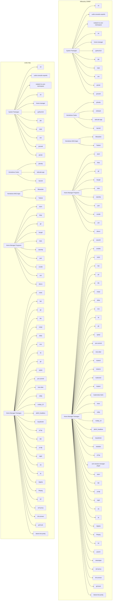

```mermaid
graph TD
    subgraph "MBeasley-23MBP"
        A[System Packages]
        B[Homebrew Casks]
        C[Homebrew MAS Apps]
        D[Home Manager Programs]
        E[Home Manager Packages]

        A --> A1[nil]
        A --> A2[uutils-coreutils-noprefix]
        A --> A3[reattach-to-user-namespace]
        A --> A4[nh]
        A --> A5[home-manager]
        A --> A6[python313]
        A --> A7[pip]
        A --> A8[sops]
        A --> A9[vim]
        A --> A10[gnutar]
        A --> A11[gnused]

        B --> B1[ghostty]
        B --> B2[orbstack]
        B --> B3[tailscale-app]
        B --> B4[raycast]

        C --> C1[Bitwarden]
        C --> C2[Todoist]

        D --> D1[atuin]
        D --> D2[btop]
        D --> D3[git]
        D --> D4[lazygit]
        D --> D5[helix]
        D --> D6[starship]
        D --> D7[yazi]
        D --> D8[zoxide]
        D --> D9[zsh]
        D --> D10[direnv]

        E --> E1[awscli2]
        E --> E2[ansible]
        E --> E3[restic]
        E --> E4[bat]
        E --> E5[go]
        E --> E6[bfs]
        E --> E7[cargo]
        E --> E8[delta]
        E --> E9[eza]
        E --> E10[fd]
        E --> E11[gh]
        E --> E12[ugrep]
        E --> E13[pre-commit]
        E --> E14[tree-sitter]
        E --> E15[kubectl]
        E --> E16[kubectx]
        E --> E17[kubecolor]
        E --> E18[kubent]
        E --> E19[kubernetes-helm]
        E --> E20[krew]
        E --> E21[viddy]
        E --> E22[nodejs_22]
        E --> E23[jdk24_headless]
        E --> E24[lazydocker]
        E --> E25[obsidian]
        E --> E26[p7zip]
        E --> E27[ssm-session-manager-plugin]
        E --> E28[stern]
        E --> E29[tldr]
        E --> E30[yt-dlp]
        E --> E31[wget]
        E --> E32[yq]
        E --> E33[jq]
        E --> E34[ripgrep]
        E --> E35[ffmpeg]
        E --> E36[fzf]
        E --> E37[pulumi]
        E --> E38[steampipe]
        E --> E39[ssh-proxy]
        E --> E40[tilt-connect]
        E --> E41[git-hunk]
        E --> E42[blame-line-pretty]
    end

    subgraph "snafu-mbp"
        F[System Packages]
        G[Homebrew Casks]
        H[Homebrew MAS Apps]
        I[Home Manager Programs]
        J[Home Manager Packages]

        F --> F1[nil]
        F --> F2[uutils-coreutils-noprefix]
        F --> F3[reattach-to-user-namespace]
        F --> F4[nh]
        F --> F5[home-manager]
        F --> F6[python313]
        F --> F7[pip]
        F --> F8[sops]
        F --> F9[vim]
        F --> F10[gnused]
        F --> F11[gnutar]

        G --> G1[ghostty]
        G --> G2[tailscale-app]
        G --> G3[raycast]

        H --> H1[Bitwarden]
        H --> H2[Todoist]

        I --> I1[atuin]
        I --> I2[btop]
        I --> I3[git]
        I --> I4[lazygit]
        I --> I5[helix]
        I --> I6[starship]
        I --> I7[yazi]
        I --> I8[zoxide]
        I --> I9[zsh]
        I --> I10[direnv]
        
        J --> J1[restic]
        J --> J2[bat]
        J --> J3[go]
        J --> J4[bfs]
        J --> J5[cargo]
        J --> J6[delta]
        J --> J7[eza]
        J --> J8[fd]
        J --> J9[gh]
        J --> J10[ugrep]
        J --> J11[pre-commit]
        J --> J12[tree-sitter]
        J --> J13[viddy]
        J --> J14[nodejs_22]
        J --> J15[jdk24_headless]
        J --> J16[lazydocker]
        J --> J17[p7zip]
        J --> J18[tldr]
        J --> J19[yt-dlp]
        J --> J20[wget]
        J --> J21[yq]
        J --> J22[jq]
        J --> J23[ripgrep]
        J --> J24[ffmpeg]
        J --> J25[fzf]
        J --> J26[ssh-proxy]
        J --> J27[tilt-connect]
        J --> J28[git-hunk]
        J --> J29[blame-line-pretty]
    end
```
