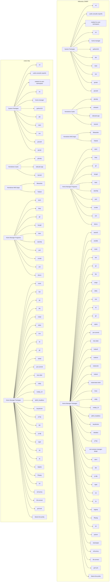

```mermaid
graph TD
    subgraph MBeasley-23MBP
        A1[System Packages]
        A2[Homebrew Casks]
        A3[Homebrew MAS Apps]
        A4[Home Manager Programs]
        A5[Home Manager Packages]

        A1 --> a1_1[nil]
        A1 --> a1_2[uutils-coreutils-noprefix]
        A1 --> a1_3[reattach-to-user-namespace]
        A1 --> a1_4[nh]
        A1 --> a1_5[home-manager]
        A1 --> a1_6[python313]
        A1 --> a1_7[pip]
        A1 --> a1_8[sops]
        A1 --> a1_9[vim]
        A1 --> a1_10[gnutar]
        A1 --> a1_11[gnused]

        A2 --> a2_1[ghostty]
        A2 --> a2_2[orbstack]
        A2 --> a2_3[tailscale-app]
        A2 --> a2_4[raycast]

        A3 --> a3_1[Bitwarden]
        A3 --> a3_2[Todoist]

        A4 --> a4_1[atuin]
        A4 --> a4_2[btop]
        A4 --> a4_3[git]
        A4 --> a4_4[lazygit]
        A4 --> a4_5[helix]
        A4 --> a4_6[starship]
        A4 --> a4_7[yazi]
        A4 --> a4_8[zoxide]
        A4 --> a4_9[zsh]
        A4 --> a4_10[direnv]

        A5 --> a5_1[awscli2]
        A5 --> a5_2[ansible]
        A5 --> a5_3[restic]
        A5 --> a5_4[bat]
        A5 --> a5_5[go]
        A5 --> a5_6[bfs]
        A5 --> a5_7[cargo]
        A5 --> a5_8[delta]
        A5 --> a5_9[eza]
        A5 --> a5_10[fd]
        A5 --> a5_11[gh]
        A5 --> a5_12[ugrep]
        A5 --> a5_13[pre-commit]
        A5 --> a5_14[tree-sitter]
        A5 --> a5_15[kubectl]
        A5 --> a5_16[kubectx]
        A5 --> a5_17[kubecolor]
        A5 --> a5_18[kubent]
        A5 --> a5_19[kubernetes-helm]
        A5 --> a5_20[krew]
        A5 --> a5_21[viddy]
        A5 --> a5_22[nodejs_22]
        A5 --> a5_23[jdk24_headless]
        A5 --> a5_24[lazydocker]
        A5 --> a5_25[obsidian]
        A5 --> a5_26[p7zip]
        A5 --> a5_27[ssm-session-manager-plugin]
        A5 --> a5_28[stern]
        A5 --> a5_29[tldr]
        A5 --> a5_30[yt-dlp]
        A5 --> a5_31[wget]
        A5 --> a5_32[yq]
        A5 --> a5_33[jq]
        A5 --> a5_34[ripgrep]
        A5 --> a5_35[ffmpeg]
        A5 --> a5_36[fzf]
        A5 --> a5_37[pulumi]
        A5 --> a5_38[steampipe]
        A5 --> a5_39[ssh-proxy]
        A5 --> a5_40[tilt-connect]
        A5 --> a5_41[git-hunk]
        A5 --> a5_42[blame-line-pretty]
    end

    subgraph snafu-mbp
        B1[System Packages]
        B2[Homebrew Casks]
        B3[Homebrew MAS Apps]
        B4[Home Manager Programs]
        B5[Home Manager Packages]

        B1 --> b1_1[nil]
        B1 --> b1_2[uutils-coreutils-noprefix]
        B1 --> b1_3[reattach-to-user-namespace]
        B1 --> b1_4[nh]
        B1 --> b1_5[home-manager]
        B1 --> b1_6[python313]
        B1 --> b1_7[pip]
        B1 --> b1_8[sops]
        B1 --> b1_9[vim]
        B1 --> b1_10[gnused]
        B1 --> b1_11[gnutar]

        B2 --> b2_1[ghostty]
        B2 --> b2_2[tailscale-app]
        B2 --> b2_3[raycast]

        B3 --> b3_1[Bitwarden]
        B3 --> b3_2[Todoist]

        B4 --> b4_1[atuin]
        B4 --> b4_2[btop]
        B4 --> b4_3[git]
        B4 --> b4_4[lazygit]
        B4 --> b4_5[helix]
        B4 --> b4_6[starship]
        B4 --> b4_7[yazi]
        B4 --> b4_8[zoxide]
        B4 --> b4_9[zsh]
        B4 --> b4_10[direnv]

        B5 --> b5_1[restic]
        B5 --> b5_2[bat]
        B5 --> b5_3[go]
        B5 --> b5_4[bfs]
        B5 --> b5_5[cargo]
        B5 --> b5_6[delta]
        B5 --> b5_7[eza]
        B5 --> b5_8[fd]
        B5 --> b5_9[gh]
        B5 --> b5_10[ugrep]
        B5 --> b5_11[pre-commit]
        B5 --> b5_12[tree-sitter]
        B5 --> b5_13[viddy]
        B5 --> b5_14[nodejs_22]
        B5 --> b5_15[jdk24_headless]
        B5 --> b5_16[lazydocker]
        B5 --> b5_17[p7zip]
        B5 --> b5_18[tldr]
        B5 --> b5_19[yt-dlp]
        B5 --> b5_20[wget]
        B5 --> b5_21[yq]
        B5 --> b5_22[jq]
        B5 --> b5_23[ripgrep]
        B5 --> b5_24[ffmpeg]
        B5 --> b5_25[fzf]
        B5 --> b5_26[ssh-proxy]
        B5 --> b5_27[tilt-connect]
        B5 --> b5_28[git-hunk]
        B5 --> b5_29[blame-line-pretty]
    end
```
